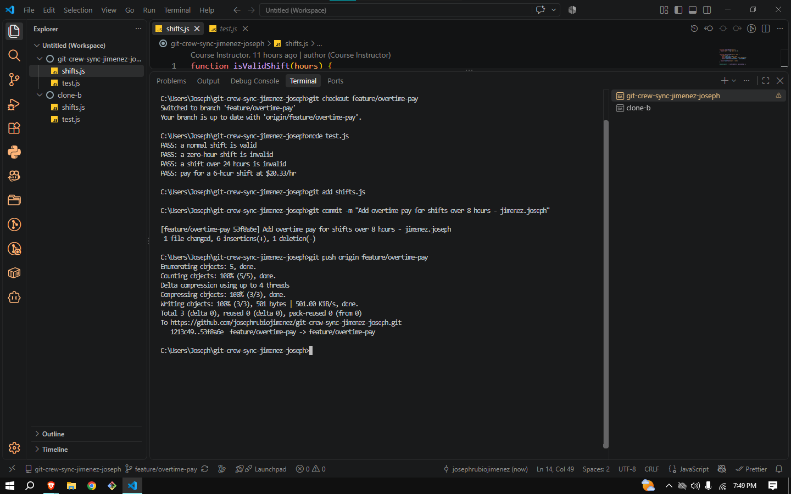
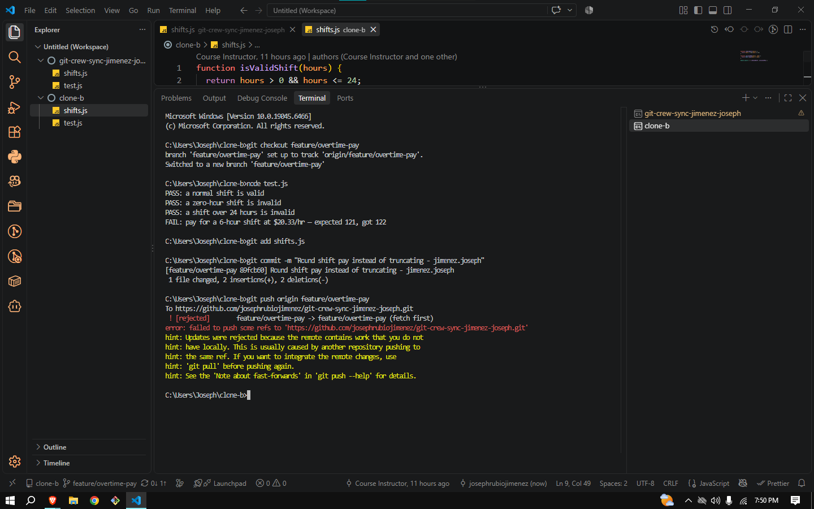
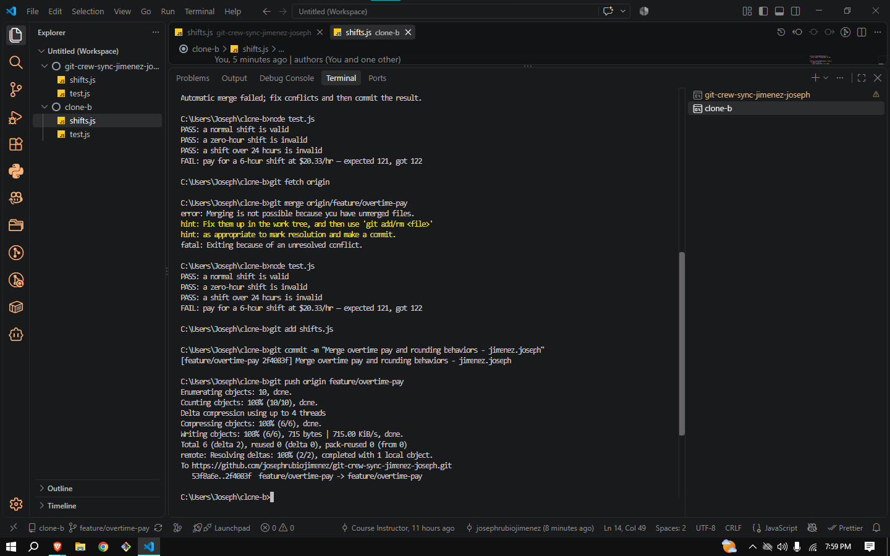
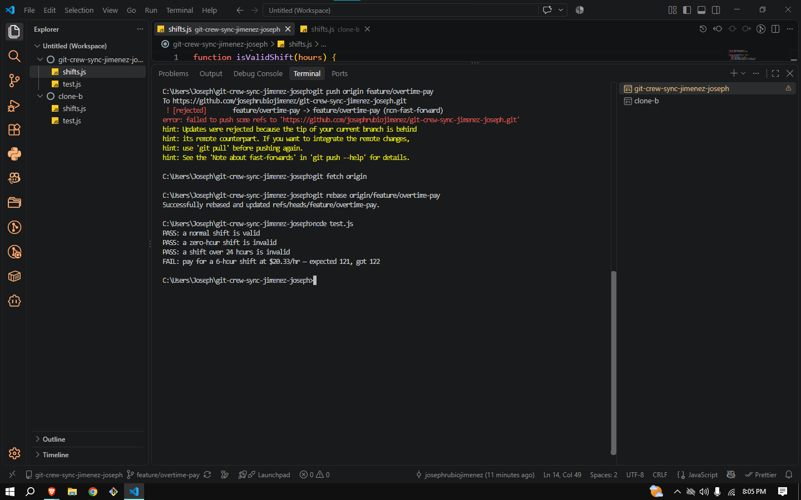
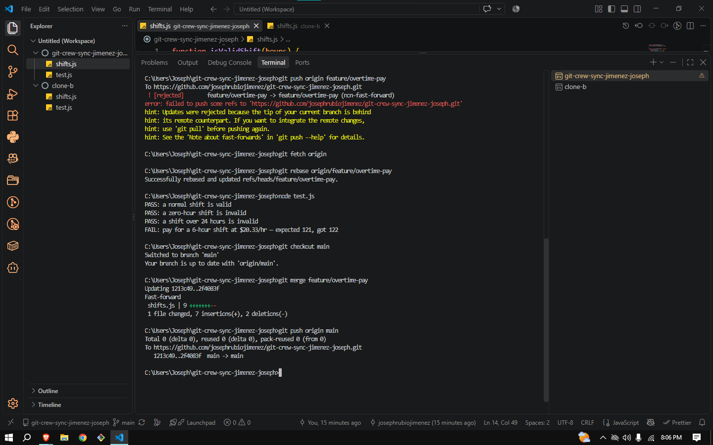
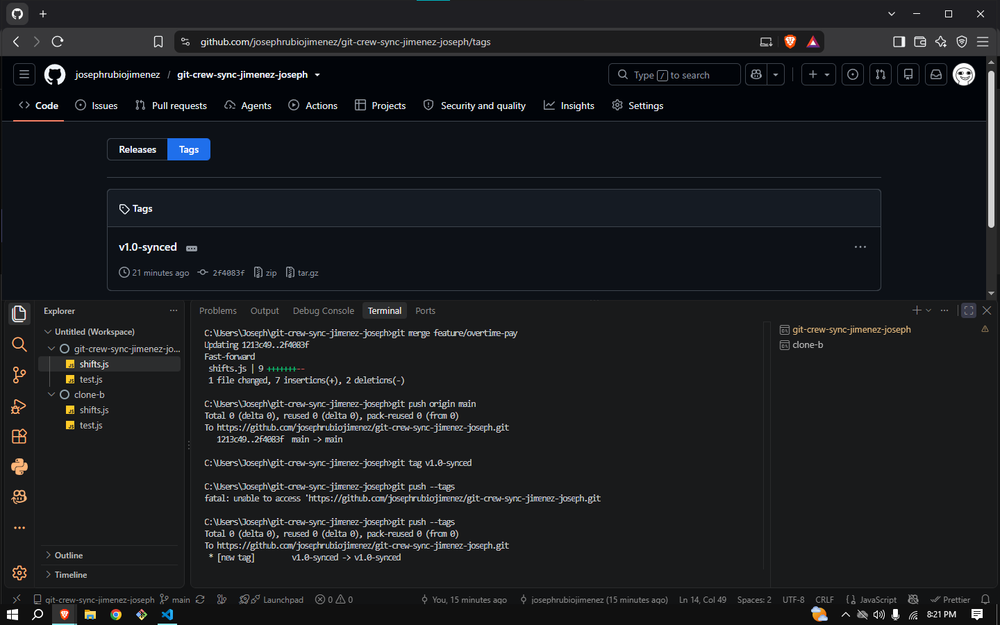

# WORKFLOW.md

## Task 1
terminal showing the successful push from Clone A

## Task 2
terminal showing the REJECTED push from Clone B - the "! [rejected]" line and hint text must be visible

## Task 3
terminal showing the conflict/resolution and the successful push afterward

## Task 4
terminal showing the second rejected push, and separately the rebase conflict and resolution

## Task 5
terminal showing main updated and pushed

## Task 6
terminal showing the tag created and pushed, and your GitHub repo page showing the v1.0-synced tag

## Questions

### 1. What did the rejected push error message tell you, and why did it happen?
The error message told me that my push was rejected because the tip of my local branch was behind 
the remote. Git cannot do a fast-forward push when the remote has commits that my local branch 
does not have. It happened because my teammate (clone-b) had already pushed changes to the 
same branch while I was working locally.

### 2. What's the actual difference between how you resolved Task 3 (merge) vs Task 4 (rebase)?
In Task 3, I used git merge which created a new merge commit that joined both branch histories 
together. This preserved the full history of both changes, showing exactly when and where they 
diverged and came back together. In Task 4, I used git rebase which took my local commit and 
replayed it on top of the remote commits. Instead of creating a merge commit, rebase rewrites 
the commit history to appear linear, as if my changes were made after the remote changes all 
along. The end result is the same code, but rebase produces a cleaner history while 
merge shows the true parallel development that happened.

### 3. What one habit would have avoided both rejected pushes in this lab?
I will always running git pull before starting any new work on a shared branch. If I had pulled at the 
start of each task, my local branch would have had the latest commits from the remote, and my 
push would have been a clean fast-forward with no rejection. The rejected push only happens when 
I start working from a stale local branch that has fallen behind the remote.

### 4. Which approach - merge or rebase - would you default to on a shared team branch, and why?
I would go with merge on a shared team branch. The main reason is that merge keeps the history 
honest and you can actually see when two people were working on the same thing at the same time 
and how it got resolved. Rebase makes the history look cleaner but it does that by rewriting 
commits that other teammates may have already pulled and built on top of and that can create a 
really confusing situation where someone suddenly has duplicate commits or unexplained conflicts and I think it is more important to keep things safe and predictable for everyone 
on the team than to have a perfectly straight commit history.